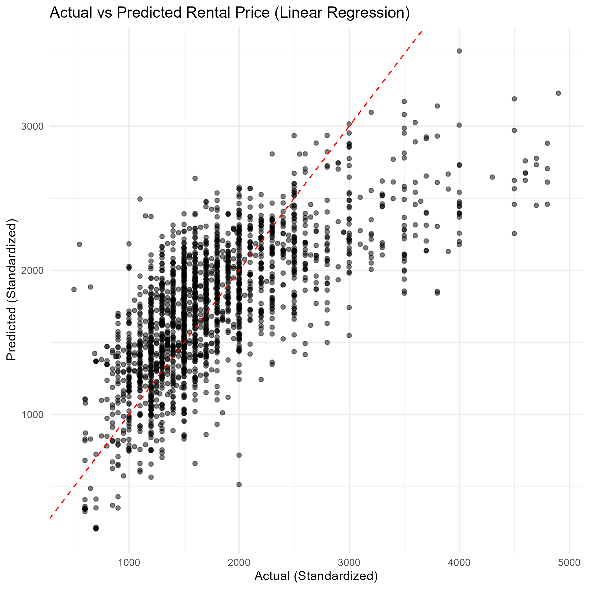
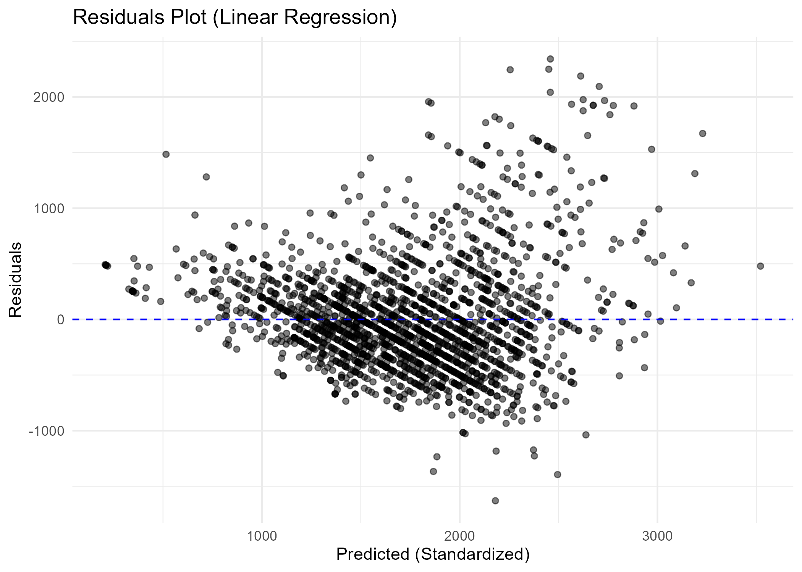
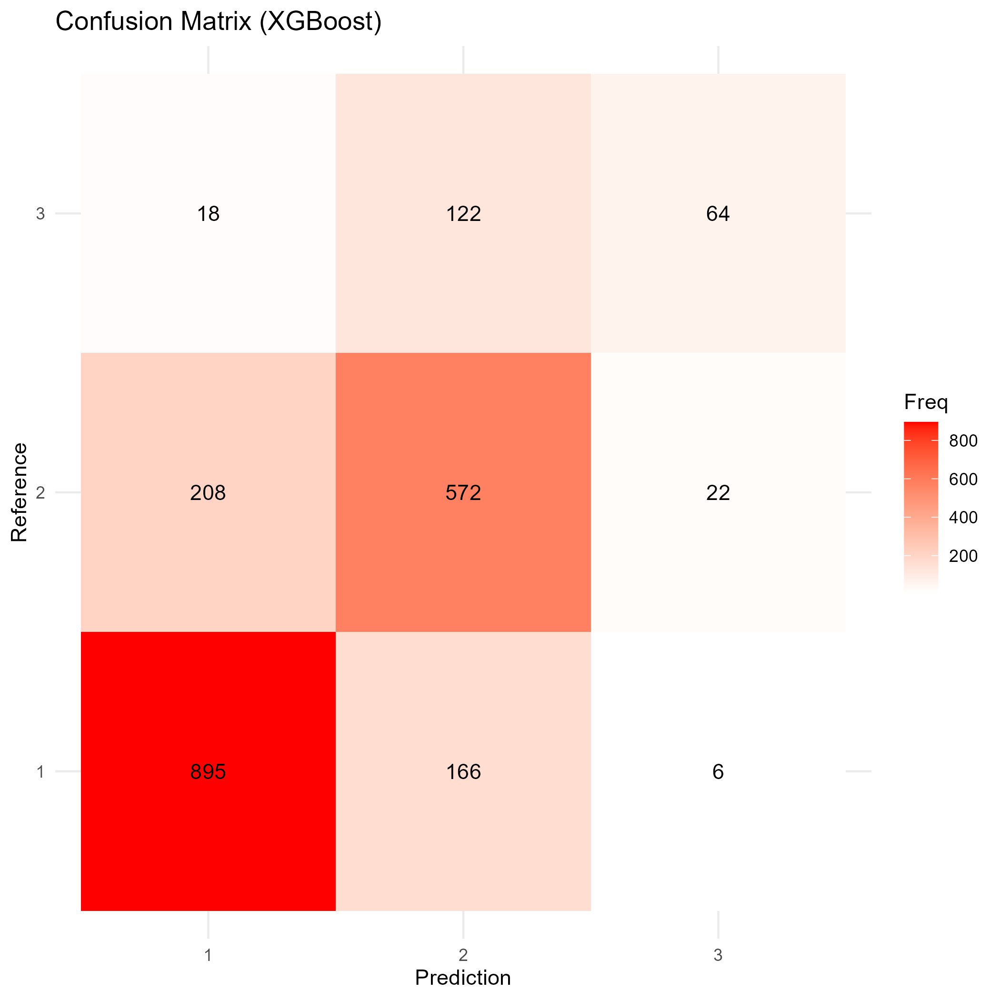
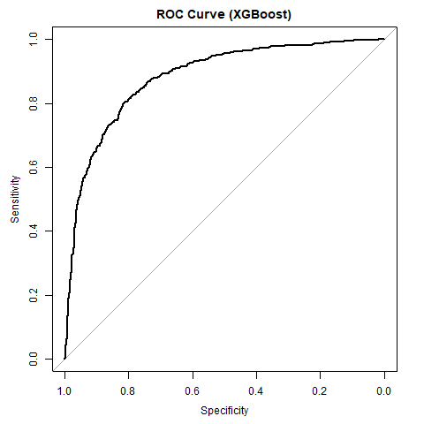

```{=html}
<style>
body {
  background-color: #f7cac9;
}
</style>
```

::: {style="text-align: right;"}
WQD7004 Group Project - OCC1 - Group G03

Richie Teoh (24088171)\
Elmer Lee Jia Zhao (24082366)\
Micole Chung Syn Tung (24073625)\
Lee Re Xuan (24071969)\
Angeline Tan Jie Lin (24084444)

01 June 2025
:::

------------------------------------------------------------------------

# **1. Introduction**

As Kuala Lumpur and Selangor continue to develop, they attract many young professionals and individuals from other states seeking better career opportunities. With the rising cost of living—particularly in Kuala Lumpur—renting has become a more practical choice, especially for newcomers to the urban workforce.

Proximity to public transport such as LRT, MRT, and KTM is a key factor in rental decisions, helping tenants save on transport costs. Rental prices vary widely depending on location, unit size, furnishing, and amenities. For instance, apartments in Bangsar South typically start from RM2,000 (PropertyGuru, 2024; EdgeProp, 2024).

This project analyzes apartment rental listings from *mudah.my* in Kuala Lumpur and Selangor to uncover key pricing patterns. A regression model will be used to predict rental prices, while a classification model will explore furnishing status based on property features. The findings aim to support better decision-making for both tenants and property owners.

## Title:

-   Prediction of Rental Price via Regression and Classification of Property Furnishing Level in Klang Valley, Malaysia.

## Questions:

-   The purpose of processing this dataset is to identify and understand the factors that influence apartment rental prices in Kuala Lumpur and Selangor. By analyzing various features of rental listings, such as property size, location, number of rooms, furnishing status, and proximity to transportation, the project aims to uncover patterns within the rental market and derive predictive insights.

    This project focuses on addressing two key analytical questions:

    1.  What are the key factors that influence rental prices, and how can rental prices be predicted using property features?

    ```         
    -   This question is approached using regression analysis. The objective is to construct a predictive model that estimates rental prices based on selected variables such as square footage, number of bedrooms, floor level, and furnishing status. The model is intended to provide a quantitative understanding of how each feature contributes to pricing, and to enable estimation of rental prices for new listings.
    ```

    2.  Can the furnishing status of an apartment (i.e., fully furnished, partially furnished, or unfurnished) be predicted based on other property characteristics?

    ```         
    -   This question is addressed using classification techniques. The objective is to develop a model that classifies rental listings into one of the three furnishing categories based on features such as rental price, location, property size, and number of bedrooms and bathrooms. This classification provides insights into the relationship between apartment features and furnishing status, and may support both tenant preferences and market supply analysis.
    ```

## Project Goal:

-   This project aims to analyze apartment rental listings from Kuala Lumpur and Selangor using data sourced from *mudah.my*. The main objectives are:

1)  To clean and preprocess the dataset to ensure consistency, accuracy, and readiness for analysis by handling missing values, formatting issues, and irrelevant variables.
2)  To develop a regression model that predicts apartment rental prices based on key property features such as size, location, number of rooms, and furnishing status.
3)  To develop a classification model that predicts the furnishing status of an apartment unit (i.e. fully furnished, partially furnished, or unfurnished) based on property features such as size, location, number of bedrooms, and rental price.

```{r}
# Load required libraries for data manipulation, visualization, and machine learning
library(tidyverse)
library(dplyr)
library(stringr)
library(ggplot2)
library(reshape2)
library(caret)
library(xgboost)
library(lightgbm)
library(nnet)
```

```{r}
# Load the dataset
df <- read.csv('mudah-apartment-kl-selangor.csv')
head(df)
```

```{r}
# Create a metadata table describing each key column
metadata <- tibble(
  Column_Name = c(
    "ads_id",
    "prop_name",
    "completion_year",
    "monthly_rent",
    "location",
    "property_type",
    "rooms",
    "parking",
    "bathroom",
    "size",
    "furnished",
    "facilities",
    "additional_facilities"
  ),
  Description = c(
    "Unique identifier for the listing",
    "Name of the building/property",
    "Completion/established year of the property",
    "Monthly rent in Ringgit Malaysia (RM)",
    "Property location within Kuala Lumpur region",
    "Type of property (apartment, condo, flat, etc.)",
    "Number of rooms in the unit",
    "Number of parking spaces for the unit",
    "Number of bathrooms in the unit",
    "Total area of the unit in square feet",
    "Furnishing status of the unit (fully, partial, non-furnished)",
    "Main facilities available",
    "Additional facilities (e.g., proximity to mall, school, railway, etc.)"
  )
)

# Print the metadata table
metadata
```

From the metadata extracted from Kaggle above: - ads_id should be dropped as it is a unique identifier for the Mudah rental listing. - prop_name can influence the rental price, for example properties under well-known developers such as Arte tend to be higher-priced; however, it does not generalize well and unseen property names might cause issues in the model. Henceforth, we decide to drop this variable as well. - completion_year includes some NA values, will investigate further, completion_year contributes to the price and the info are usually available online, hence we will impute it manually from data found online. - monthly_rent is saved as chr type due to the "RM" prefixes, will perform appropriate data transformation. - size is saved as chr type due to the "sq. ft." suffixes, will perform appropriate data transformation.

## Data Pre-processing

The dataset was filtered to include only listings labeled as "Serviced Residences" or "Condominium" to reduce noise and focus the analysis on high-rise residential properties. Duplicate entries based on `ads_id` were removed by retaining only the row with the least number of missing values, ensuring cleaner and more reliable input for modeling.

```{r}
# Data Pre-processing

# Filter only serviced residences and condo
df <- df %>%
  filter(.data[['property_type']] %in% c('Service Residence','Condominium'))

# Check and Remove duplicated values.
duplicates_only <- df %>%
  filter(duplicated(df) | duplicated(df, fromLast = TRUE)) %>%
  arrange(ads_id)

duplicates_ads_id <- df %>%
  filter(duplicated(df['ads_id']) | duplicated(df['ads_id'], fromLast = TRUE)) %>%
  arrange(ads_id)

head(duplicates_only)
head(duplicates_ads_id)
```

```{r}
# Remove duplicates based on 'ads_id'
cleaned_df <- df %>%
  mutate(na_count = rowSums(is.na(.))) %>%
  group_by(ads_id) %>%
  arrange(na_count) %>%
  dplyr::slice(1) %>%
  ungroup() %>%
  select(-na_count)

sum(duplicated(cleaned_df['ads_id']))
df <- cleaned_df

# 
```

## Check for Missing Data and Imputation

To ensure data quality, the dataset was examined for missing values. The total number of missing entries and the distribution of missing data across each column were identified using `sum(is.na(df))` and `colSums(is.na(df))`. This step provides insight into the completeness of the dataset and informs whether imputation or removal is necessary for affected variables.

```{r}
# Check for missing values in the entire dataset and by individual columns
sum(is.na(df))
colSums(is.na(df))
```

## Data Cleaning

This step involves cleaning text-based numeric fields (`monthly_rent` and `size`) by removing prefixes, suffixes, and formatting characters, then converting them into numeric types. Rows with missing rental prices were removed, as this value is essential for price prediction. Additionally, listings with missing `completion_year` were inspected for possible further handling.

```{r}
# Data Cleaning

# 1) Removing prefix 'RM' and suffix 'per month' from monthly rent, removing white spaces from 1 700, and convert to numeric type.
df <- df %>%
  mutate(
    monthly_rent = str_remove_all(monthly_rent, "RM|per month|,"),
    monthly_rent = str_remove_all(monthly_rent, " "),
    monthly_rent = as.numeric(monthly_rent)
  )

# 2) Removing suffix 'sq. ft.' from size, removing any white spaces, and convert to numeric type.
df <- df%>%
  mutate(
    size = str_remove_all(size, "sq\\.ft\\."),
    size = str_remove_all(size, " "),
    size = as.numeric(size)
  )

# Check which listings have missing 'completion_year'
unique(df[is.na(df$completion_year), "prop_name"])

# Check rows with missing 'monthly_rent'
df[is.na(df$monthly_rent),]

# Remove rows with missing 'monthly_rent'
df <- df %>%
  filter(!is.na(monthly_rent))
```

Interesting case, Affina Bay is located in Butterworth but included in this webscrapped Klang Valley Mudah listing. Henceforth, we will take more time to clean the data properly based on the listing's location.

```{r}
# Check all unique values in the 'location' column
unique(df['location'])
```

While reviewing the unique values in the `location` column, several entries appear inconsistent or non-standard, such as *"Selangor - 389"*, *"Selangor - 517"*, and *"Kuala Lumpur - Others"*.

```{r}
# Identify suspicious or unclear location values
suspicious_location <- c('Selangor - 389', 'Selangor - 360', 'Kuala Lumpur - Others', 'Selangor - 517', 'Selangor - 639')

# View all rows with those suspicious location values
df[df$location %in% suspicious_location,]

# Check if any property names contain the word "Ayuman"
df %>%
  filter(grepl("Ayuman", prop_name))
```

```{r}
# Investigating number of rooms
unique(df$rooms)

df <- df %>%
  mutate(
    rooms = case_when(
      rooms == "More than 10" ~ 10L,                 # Convert "more than 10" to integer 10
      TRUE ~ as.integer(rooms)                      # Otherwise, convert to integer
    )
  )

df[df$rooms >= 6,]
df[!df$ads_id %in% c(95078151,98657827,98910302,99729522,99760048,100065541,100013966,100303122),]
```

Interestingly, we see quite a varying number of rooms ranging from 1 to 10, usually a unit is available in 2 - 5 rooms, hence let us investigate the other values. From the rows, we could see that some units have 6 or more rooms despite only having size less than 2000 sq. ft., hence we will exclude ads_id %in\$ c(95078151,98657827,98910302,99729522,99760048,100065541,100013966,100303122)

For the column *parking*, we decide to fill the NA values with 0.

```{r}
df$parking[is.na(df$parking)] <- 0
```

For the column *completion_year*, we decide to fill NA values via median value of the locations.

```{r}
# Impute missing 'completion_year' values using the median year within the same location group
df <- df %>%
  group_by(location) %>%
  mutate(completion_year = ifelse(is.na(completion_year), median(completion_year, na.rm = TRUE), completion_year))


# Load manually collected property names and their completion years
df_manual_prop <- read.csv('manual_prop_year.csv', header=FALSE)
colnames(df_manual_prop) <- c('prop_name','completion_year')


# Merge manual data with main dataset and update 'completion_year' where manual values are available
df <- df %>%
  left_join(df_manual_prop, by = "prop_name", suffix = c("_raw", "_manual")) %>%
  mutate(completion_year = coalesce(completion_year_raw, completion_year_manual)) %>%
  select(-completion_year_raw, -completion_year_manual)


# Use global median to fill any remaining missing 'completion_year'
global_median_year <- median(df$completion_year, na.rm = TRUE)

df <- df %>%
  mutate(completion_year = coalesce(completion_year, global_median_year))
```

## Final results after Cleaning

After applying all cleaning steps, the dataset is free from duplicates and missing values in key fields such as `monthly_rent`, `size`, and `completion_year`. Inconsistent entries were filtered or corrected, and numeric fields were standardized for analysis. The cleaned dataset is now ready for exploratory analysis and modeling.

```{r}
# Check the number of missing values in each column after data cleaning
colSums(is.na(df))
```

## Pre-Feature Engineering

The `ggmap` package is used to retrieve geographic coordinates (latitude and longitude) for each property and calculate the distance to well-known landmarks in Kuala Lumpur, such as KLCC, Bukit Bintang, and TRX. This helps capture location-based value, which is an important factor in determining rental price.

```{r}
df$full_location <- paste0(df$location, ",", df$prop_name)

# Get the unique values (Reduce the computation resource)
unique_locations <- unique(df$full_location)

# Print the unique locations
head(unique_locations) #3019 rows
```

Below is the R code, that connecting with the Google Routes API. Setup with the Google Maps library ggmap, then set up the destination location starting from property location (unique_locations). After that, using expand_grid to combine all of the location in total will be 9057 (3\*3019) then running by for-loop looping all of the property location by using mapdist which return the distance between the two location in a driving model. The result will be save into a list, after that using bind_rows combine all of the inner element (data frame) into a final table. Is important to setyp the try-catch and system sleep to handle the error such as location can't be found then directly pause the for-loop function and using system sleep to reduce to overwhelmed due to lack data calling from API.

``` r
R code of finding the distance from the two location.

library(ggmap)
library(dplyr)
library(tidyr) # For expand_grid
register_google(key = "API KEY") #Google Map API Key

#Set the destination location for the KL hotspot
destination_addresses <- c(
  "Kuala Lumpur, TRX",
  "Kuala Lumpur City Centre",
  "Bukit Bintang, Kuala Lumpur"
)

all_od_pairs <- expand_grid(
  origin = unique_locations,
  destination = destination_addresses
)

results_list <- list()

for (i in 1:nrow(all_od_pairs)) {
  current_origin <- all_od_pairs$origin[i]
  current_destination <- all_od_pairs$destination[i]
  
  print(paste0("Calculating route from '", current_origin, "' to '", current_destination, "'"))
  tryCatch({
     route_info_pair <- mapdist(from = current_origin, to = current_destination, mode = "driving")
     results_list[[i]] <- route_info_pair
     Sys.sleep(0.5) # Pause for 0.5 seconds to avoid rate limits (adjust as needed)
  }, 
  error = function(e) #In case, the location can't be found
  {
    message("Error calculating route: ", e$message)
    results_list[[i]] <- data.frame(from = current_origin, to = current_destination, km = NA, 
                                   hours = NA, error = e$message)
  })
 }

 final_route_df <- bind_rows(results_list)
 print(final_route_df)
```

Saving final_route_df into "property_route.csv", then read saving into data frame. Each time calling the API will increase the time consumption and computer computation resource, by saving into the csv file able to reduce it.

```{r}
df_property_route <- read.csv('property_route.csv')
head(df_property_route)
```

Searching from the missing distance between the two locations, manually adding the location.

```{r}
print(paste0("Missing value:", colSums(is.na(df_property_route))))

df_missing_route <- which(apply(is.na(df_property_route), 1, any))
df_property_route[df_missing_route,]

df_insert_missing_from <- data.frame(
  from = c("Kuala Lumpur - Kepong,Greenview Apartments", "Kuala Lumpur - Kepong,", 
           "Kuala Lumpur - Kepong,Aman Dua",
           "Kuala Lumpur - Kepong,Saujana Ria Aparment",
           "Kuala Lumpur - Kepong,Sri Saujana Apartment (Wangsa Permai)",
           "Kuala Lumpur - Kepong,VIM 3 @ Desa Park North",
           "Kuala Lumpur - Kepong,opal flat"),
  distance_to_TRX = c(12.6, 16.2, 20.2, 20.8, 20.8, 17.7, 18.2),
  distance_to_KLCC = c(9.9, 13.5, 16.9, 17.6, 17.6, 15.2, 14.7),
  distance_to_BukitBintang = c(11.8, 15.5, 19.4, 20.1, 20.1, 16.9, 16.6)
)
df_insert_missing_from
```

Storing the searching route result into main data frame (df).

```{r}
df_property_distance <- df_property_route %>%
  select(from, to, km) %>% #Select the key attribute (from, to, km)
  pivot_wider(             #Splitting the km between the two location to each column by using pivot_wider
    names_from = to,       
    values_from = km,     
    names_prefix = "distance_to_" 
  )

#Rename the columns
df_property_distance <- df_property_distance %>%
  rename(
    distance_to_TRX = `distance_to_Kuala Lumpur, TRX`,
    distance_to_KLCC = `distance_to_Kuala Lumpur City Centre`,
    distance_to_BukitBintang = `distance_to_Bukit Bintang, Kuala Lumpur`
  )

#Checking the missing value before implement replacement
print(paste0("Before Implement Replacement for Missing value:", colSums(is.na(df_property_distance))))

df_property_distance_new <- data.frame(df_property_distance) #Make a copy

#Drop all of the NA value
df_property_distance_new <- df_property_distance_new %>%
  drop_na(distance_to_TRX, distance_to_KLCC, distance_to_BukitBintang)

#Merge the replacement data frame with the copy of property distance data frame
df_property_distance <- bind_rows(df_property_distance_new, df_insert_missing_from)

#Check missing value after replacement
print(paste0("After Implement Replacement for Missing value:", colSums(is.na(df_property_distance))))

# Mapping the distance into the "df" data frame, searching the matching full_location with the "from"
df <- df %>%
  left_join(df_property_distance, by = c("full_location" = "from"))

head(df)
```

To get the average distance, we will using rowMeans() function to calculate the distance from each row then result in a popular_location_distance column.

```{r}
df_import_PopularLocation <- data.frame(df) #Make a copy

df_import_PopularLocation <- df_import_PopularLocation %>%
  mutate(
    Popular_location_distance = rowMeans( #Calculate the mean for each distance (row)
      select(., distance_to_TRX, distance_to_KLCC, distance_to_BukitBintang),
      na.rm = TRUE #Skipping the empty value, select valid numberic value
    )
  )
df <- df_import_PopularLocation
head(df)
```

To get whether the property is near to public transport such as KTM or LRT, if the words appear in the additional facilities it will create as 1 (Yes) stored inside the `near_public_transport` column else will be stored as 0 (No).

```{r}
df <- df %>%
  mutate(near_public_transport = as.integer(grepl("Near KTM/LRT", additional_facilities, ignore.case = TRUE)))
head(df)
```

# Data Visualization

Exploratory Data Analysis was performed to better understand the structure, patterns, and relationships within the dataset. This includes examining distributions of key variables, identifying correlations between features, detecting outliers, and visualizing trends that may influence rental prices and furnishing levels. The insights gained from EDA guide feature selection and model development in later stages.

```{r}
df_EDA = data.frame(df) #Make a copy for EDA
head(df_EDA)
```

## Univariate Analysis

Univariate analysis focuses on understanding the distribution and characteristics of individual variables within the dataset. This includes examining variables such as monthly rent, property size, number of rooms, and furnishing status. Visualizations like histograms, bar charts, and summary statistics are used to identify patterns, outliers, and data skewness, providing valuable insights for feature selection and modeling.

### Histogram of Monthly Rent

This section shows a histogram of monthly rent. The diagram below will be only consist of the monthly rent that is below than 5000 MYR (\<= 5000). Based on the summary results, the upper bound is about 2,100 (MYR), therefore splitting into parts below 5,000 (MYR) able provides a visualization on the monthly pricing, and exclude the outliers.

In addition, the most common rent range as observe will be between RM1000 to RM2000 this indicate that majority of the available accommodations will be fall within this price range in KL and Selangor area. In other words, this indicate at this range are more affordable for the people.

```{r}
hist_data <- (df_EDA$monthly_rent)
summary(hist_data) #Show the summary

hist_data_below <- hist_data[hist_data < 5000]

hist(
  hist_data_below, xlab = "Monthly Accommodation Rent (MYR)", main = "Monthly Accommodation Rent Distribution (< 5k)",
  col = "#A8E4A0", border = "black", breaks = 40
)

```

### Histogram of Property Size

This section shows a histogram of size. The diagram below will be only consist of the property size that is below than 3000 sq ft (\<= 3000). Based on the summary results, the upper bound is about 1,100 (sq ft).

From the observation, most of the available property/accommodation will be falls into 700 to 1200 sq ft. Commonly, the size of the property will be around 750 sq ft to 1200 sq ft. In addition, most of the property size for rent is mostly available on 800 to 900 sq ft. This shows that in urban areas, more real estate developers focus more on urban development, since largest area means highest rent.

```{r}
hist_data_size <- (df_EDA$size)
summary(hist_data_size) #Show the summary

hist_data_size_below <- hist_data_size[hist_data_size < 3000]

hist(
  hist_data_size_below, xlab = "Property Size (sq ft)", main = "Property Size Distribution (< 3,000)",
  col = "#A8E4A0", border = "black", breaks = 30
)

```

### Bar Chart of Property Attributes

This section plot horizontal bar graphs to illustrate the frequency/count of parking, rooms, bathroom, completion_year.

1.  parking: Present from 0 to 10, majority of the rent estate will be giving at least 1 car parking slot, but some provide 0 or 2 parking slot for tenant.

2.  rooms: Illustrate that the accommodation/property are build as studio, single room, two room and mostly three room.

3.  bathroom: Illustrate that for the majority of accommodation/property will having 2 bathroom. Since, majority of rooms is between 1 to 3, so that typically it will have 1 or 2 bathrooms.

4.  completion_year: This show that massive of accommodation/property was starting arise after 2012. 2014 to 2022 is the peak period, indicating that due to the development of the city, the demand for accommodation is also rising.

```{r}
plot_bar_chart_char <- function(bar_chart_columns) {
  
  for (col in bar_chart_columns) {
    counts_data <- df_EDA[[col]]
  
    unique(df_EDA$col)
    
    # Count occurrences
    category_counts <- table(counts_data)
    
    # Plot horizontal bar chart
    barplot(category_counts,
            col = "skyblue",
            main = paste("Accommodation" , col, "Distribution"),
            xlab = "Count")
  }
}

bar_chart_columns <- c("parking", "rooms", "bathroom", "completion_year")
plot_bar_chart_char(bar_chart_columns)

```

## Bivariate Analysis

### Pie Chart of Property Type

In this project, the team will focus on two types of properties: apartments and serviced residences, as the target tenants are students and office workers. From the pie chart, can observe that the market prefers apartments more, has the largest proportion of 61.4%, while serviced residences proportion of 38.6%.

```{r}
property_data <- df_EDA %>% count(property_type)

ggplot(property_data, aes(x = "", y = n, fill = property_type)) +
  geom_bar(stat = "identity", width = 1) +
  coord_polar("y", start = 0) +
  geom_text(aes(label = paste0(round(n / sum(n) * 100, 1), "%")), position = position_stack(vjust = 0.5)) + 
  labs(title = "Property Type") +
  theme(legend.title = element_blank())
```

### Pie Chart of Near Public Transport

In this pie chart, from observation can be indicate that majority of the accommodation/property are not closing to the public transport (59.7%), but 40.3% of the accommodation/properties are close to public transportation. The gap between the two is around 19%, which is not a big gap, which means that most of the accommodation/properties try to be built near public transportation.

```{r}
near_public_transport_data <- df_EDA %>% count(near_public_transport)

near_public_transport_data$near_public_transport[near_public_transport_data$near_public_transport == 0] <- "No"
near_public_transport_data$near_public_transport[near_public_transport_data$near_public_transport == 1] <- "Yes"

ggplot(near_public_transport_data, aes(x = "", y = n, fill = near_public_transport)) +
  geom_bar(stat = "identity", width = 1) +
  coord_polar("y", start = 0) +
  geom_text(aes(label = paste0(round(n / sum(n) * 100, 1), "%")), position = position_stack(vjust = 0.5)) + 
  labs(title = "Near Public Transport") +
  theme(legend.title = element_blank())
```

### Pie Chart of Furnished Type

This pie chart illustrate the distribution of the furnished type as "Fully Furnished", "Not Furnished", and "Partially Furnished". From the observation, that most houses/properties provide tenants with fully furnished/partially furnished, with the results showing that 52.4% of accommodation/properties provide fully furnished, 38.2% of houses/properties provide partially furnished, and 9.4% of houses/properties do not provide any furniture.

```{r}
furnished_data <- df_EDA %>% count(furnished)

ggplot(furnished_data, aes(x = "", y = n, fill = furnished)) +
  geom_bar(stat = "identity", width = 1) +
  coord_polar("y", start = 0) +
  geom_text(aes(label = paste0(round(n / sum(n) * 100, 1), "%")), position = position_stack(vjust = 0.5)) + 
  labs(title = "Furnished Type") +
  theme(legend.title = element_blank())
```

## Multivariate Analysis

### BoxPlot - Two Relationship

In this section, the team will using boxplot to understand the relationship between monthly rent and property size. The boxplot is filtered based on the upper range to provide a clear visualization.

In the diagram show below, it clearly show a positive trend as the size increase the monthly rent also getting increase. This indicate the size of the accommodation/property will be related to the rent. In addition, there is outlines above and below of the box plot suggest that some properties may be high-end listings or quick-rent properties that are older and poorly maintained.

```{r}
#Define the bin size 
breaks <- seq(0, 3000, by = 500)
rent_size_label <- paste(head(breaks, -1), tail(breaks, -1), sep = "–") #Set the rent_size range ([0],[1])

# Filter the size < 3000 and rent < 5000
boxplot_data_filter <- df_EDA %>%
  filter(size < 3000, monthly_rent < 5000) %>%
  mutate(property_size_bin = cut(size, breaks = breaks, labels = rent_size_label))

# Box plot: Size by Rent Range
ggplot(boxplot_data_filter, aes(x = property_size_bin, y = monthly_rent)) +
  geom_boxplot(fill = "#87CEFA", color = "#4682B4", outlier.alpha = 0.3) +
  labs(
    title = "Property Size Distribution by Monthly Accommodation Rent Range",
    x = "Property Size (sq ft)",
    y = "Monthly Rent Range (MYR)"
  ) +
  theme_minimal() +
  theme(axis.text.x = element_text(hjust = 0.5))
```

In this section, present the top 20 frequency locations that appear inside the dataset, which also reflect where the majority of the accommodation/properties are built and located. In addition, from the observation that areas like Mont Kiara or KLCC contain higher rent per month, and like Kajang, Cyberjaya, or Cheras which giving more affordable rent for lower budgets renters.

```{r}
# Filter the data
most_frequent_locations <- df_EDA %>%
  count(location, sort = TRUE) #Find the most frequency location

#Filter top 20 location and < 5000 money rent
boxplot_data_filter <- df_EDA %>%
  filter(monthly_rent < 5000, location %in% most_frequent_locations$location[0:20])

ggplot(boxplot_data_filter, aes(x = reorder(location, monthly_rent, median), y = monthly_rent)) +
  geom_boxplot(fill = "#87CEFA", color = "#4682B4", outlier.alpha = 0.3) +
  labs(
    title = "Monthly Accommodation Rent Distribution by Top 20 Locations",
    x = "Location",
    y = "Monthly Rent (MYR)"
  ) +
  theme_minimal() +
  theme(axis.text.x = element_text(angle = 45, hjust = 1))
```

This box plot shows the development of the property market from 1950 to 2025. Overall, from 1980 to 2025, it can be observed that the average price of monthly rental is about RM1,400 to RM1,600, while after 2015, the rental trend becomes more stable due to more new properties entering the market.

```{r}
#Arrange completion year and < 5000 money rent
boxplot_data_filter <- df_EDA %>%
  mutate(completion_year = as.integer(completion_year)) %>%
  filter(monthly_rent < 5000) %>%
  arrange(completion_year) 

#Using factor() arrange into categories type (Grouping)
boxplot_data_filter$completion_year <- factor(
  boxplot_data_filter$completion_year
) 

ggplot(boxplot_data_filter, aes(x = completion_year, y = monthly_rent)) +
  geom_boxplot(fill = "#87CEFA", color = "#4682B4", outlier.alpha = 0.3) +
  labs(
    title = "Distribution of Monthly Rent Based on Property Completion Year",
    x = "Year",
    y = "Monthly Rent (MYR)"
  ) +
  theme_minimal() +
  theme(axis.text.x = element_text(angle = 45, hjust = 1))
```

In this boxplot illustrate that the monlthy rents will follow the furnished to increase, it indicate that an accommodation/property with fully furnished will have the average that is above RM1,500 and for partially furnished will be around RM1,300 and above, then for not furnished the overall average will be the lowest as around RM1,000 and above. However, this also shows that for landlords, fully furnished tenants are more willing to rent out their properties because it also provides more convenience for students and workers tenants, and tenants do not need to make further purchases.

```{r}
#Filter < 5000 money rent
boxplot_data_filter <- df_EDA %>%
  filter(monthly_rent < 5000)

ggplot(boxplot_data_filter, aes(x = reorder(furnished, monthly_rent, median), y = monthly_rent)) +
  geom_boxplot(fill = "#87CEFA", color = "#4682B4", outlier.alpha = 0.3) +
  labs(
    title = "Monthly Accommodation Rent Distribution by Furnished Type",
    x = "Furnished Type",
    y = "Monthly Rent (MYR)"
  ) +
  theme_minimal() +
  theme(axis.text.x = element_text(angle = 45, hjust = 1))
```

## Correlation Matrix

This section showcase a correlation matrix between each feature.

```{r}
heatmap_data <- df_EDA %>%
  select(where(is.numeric)) #Select only numeric data (remove such as prop_name, e.g.)

heatmap_data <- heatmap_data %>% select(-ads_id)  #Remove ads_id

corr_data <- cor(heatmap_data, use = "complete.obs") #Transfer into numeric (-1 , 1)
melted_corr <- melt(corr_data) #into a format for ggplot
heap_map_color <- colorRampPalette(c("skyblue", "white", "#cc474b"))(200)

# Plot
ggplot(melted_corr, aes(x = Var1, y = Var2, fill = value)) +
  geom_tile(color = "white") +
  geom_text(aes(label = round(value,2)), size = 3) +
  scale_fill_gradientn(colors = heap_map_color, limits = c(-1, 1)) +
  labs(title = "Correlation Matrix", x = NULL, y = NULL) + #Add NULL else will have Var2 and Var1
  theme(
    axis.text.x = element_text(angle = 45, hjust = 1),
    plot.title = element_text(hjust = 0.2, size = 16, face = "bold")
  )
```

# Feature Engineering

```{r}
df_feature = data.frame(df_EDA) #Make a copy for Data Modelling
head(df_feature)
```

In this section, the team will filter outliers from the dataset. Based on the early indications from the histogram and boxplot, most monthly rents are below \$5,000, housing size is below \$3,000, and the room, package, and bathroom sizes are below 6, 4, and 4, respectively. Therefore, the team will filter the data to try to keep a large sample size within the dataset.

```{r}

df_feature <- df_feature %>% filter(monthly_rent > 400 & monthly_rent < 5000)
df_feature <- df_feature %>% filter(size > 100 & size < 3000)
df_feature <- df_feature %>% filter(rooms > 0 & rooms < 6)
df_feature <- df_feature %>% filter(parking > 0 & parking < 4)
df_feature <- df_feature %>% filter(bathroom > 0 & bathroom < 4)

head(df_feature)
```

In this section, the team will perform coverting process on the dataset to prepare it for data modelling. Firstly, the team will recode the furnished column transforming the string value into numeric values "Fully Furnished" is assigned 1, "Partially Furnished" is 2, and "Not Furnished" is 3. Similar r ecode for the property type "Condominium" becomes 1 and "Service Residence" becomes 0.

Next, the team will create a new column for calculate the year built from the current year, and forming "property_age" column. Then will combines the facilities and additional facilities columns into a single column, after that removing corruption data such as containing numebric, only keep as valid character of form. In addition, calculate the number of facilities and stored inside a new column "number_facilities".

```{r}
# Make a copy (assuming df_feature exists)
df_feature_prepare = data.frame(df_feature)

# ---------------------------------------------------------------------------------
# Recode 'furnished' column
df_feature_prepare$furnished <- df_feature_prepare$furnished %>%
  recode(
    "Fully Furnished" = 1,
    "Partially Furnished" = 2,
    "Not Furnished" = 3
  ) %>%
  as.numeric()


# ---------------------------------------------------------------------------------
# Recode 'property_type'
df_feature_prepare$property_type <- df_feature_prepare$property_type %>%
  recode(
    "Condominium" = 1,
    "Service Residence" = 0
  ) %>%
  as.numeric()

# ---------------------------------------------------------------------------------
# Transform the 'completion_year' column to age of the property
current_year <- 2025
df_feature_prepare$property_age <- current_year - df_feature_prepare$completion_year

# ---------------------------------------------------------------------------------
# Combine both 'facilities' and 'additional facilities' columns

# Ensure both columns are character type before pasting to avoid issues with factors
df_feature_prepare$facilities <- as.character(df_feature_prepare$facilities)
df_feature_prepare$additional_facilities <- as.character(df_feature_prepare$additional_facilities)

# Column combining
df_combined_facilities <- df_feature_prepare %>%
  mutate(facilities_combined = paste(facilities, additional_facilities, sep = ", "))
# ---------------------------------------------------------------------------------

# Remove unwanted characters such as 10, 11, 6 in 'facilities' column
df_combined_facilities$facilities_combined <- gsub("[^a-zA-Z, ]", "", df_combined_facilities$facilities_combined)

# Count the number of facilities from 'facilities_combined'
df_facilities <- df_combined_facilities %>%
  mutate(number_facilities = sapply(strsplit(facilities_combined, ", "), length))

# ---------------------------------------------------------------------------------
#Data Attribute selection
keep_columns <- c("rooms", "parking", "bathroom", "near_public_transport",
                  "monthly_rent", "size", "Popular_location_distance", 
                  "property_type", "furnished", "property_age", "number_facilities"
                  , "location")

# Filter the wanted columns for data modelling
df_final_prepared <- df_facilities %>% select(any_of(keep_columns))

df_final_prepared$location <- factor(df_final_prepared$location)

head(df_final_prepared)
```

```{r}
heatmap_data <- df_final_prepared %>%
  select(where(is.numeric)) #Select only numeric data (remove such as prop_name, e.g.)

corr_data <- cor(heatmap_data, use = "complete.obs") #Transfer into numeric (-1 , 1)
melted_corr <- melt(corr_data) #into a format for ggplot
heap_map_color <- colorRampPalette(c("skyblue", "white", "#cc474b"))(200)

# Plot
ggplot(melted_corr, aes(x = Var1, y = Var2, fill = value)) +
  geom_tile(color = "white") +
  geom_text(aes(label = round(value,2)), size = 3) +
  scale_fill_gradientn(colors = heap_map_color, limits = c(-1, 1)) +
  labs(title = "Correlation Matrix", x = NULL, y = NULL) + #Add NULL else will have Var2 and Var1
  theme(
    axis.text.x = element_text(angle = 45, hjust = 1),
    plot.title = element_text(hjust = 0.2, size = 16, face = "bold")
  )
```

# Data Modelling

This project involves two separate predictive tasks: estimating rental prices (a regression problem) and classifying furnishing status (a multi-class classification problem). Accordingly, different models are applied for each task to optimize performance. Regression models are used to predict continuous rental prices based on property features, while classification models are trained to categorize listings into furnishing types—fully furnished, partially furnished, or unfurnished. Each model is evaluated using appropriate performance metrics aligned with its predictive objective.

```{r}
df_model = data.frame(df_final_prepared) #Make a copy for Data Modelling
head(df_model)
```

## Data Splitting

Data splitting is performed separately for both targets variables: monthly_rent for the regression model (predicting rental price) and furnished for the classification model (predicting furnishing status).

The dataset is split into training and testing sets. Training sets are used to build model, while testing sets are used to evaluate the model performance. In this case, we split the data into 80% train set and 20% test set. Separate splits are created for each model according to their respective target variable.

### Regression Model (Predict Rental Price)

For the regression task, the target variable was `monthly_rent`. The feature set included standardized property size, property age, furnishing status, proximity to public transport, property type, and one-hot encoded facilities. An 80% portion of the dataset was used to train the regression models, while the remaining 20% was used for testing. This split ensures that the model's performance metrics—such as RMSE, MAE, MSE, and R²—are evaluated on unseen data, providing a reliable measure of predictive accuracy.

```{r}
#For reproducibility
set.seed(123) 

#Split in 80/20 for train and test sets
split = 0.80 
```

Training and testing sets were created using the `createDataPartition()` function from the **caret** package. This method ensures that the split maintains the distribution of the target variable, `monthly_rent`, allowing for a representative and balanced partition between the training and testing datasets.

```{r}
train_index_regression <- createDataPartition(df_model$monthly_rent, p=split, list=FALSE) 

#Create training and testing datasets
X_train_regression <- df_model[train_index_regression,]%>% select( -monthly_rent)
X_test_regression <- df_model[-train_index_regression,]%>% select(-monthly_rent)

y_train_regression <- df_model$monthly_rent[train_index_regression]
y_test_regression <- df_model$monthly_rent[-train_index_regression]

# Print the shape of X_train_regression and y_train_regression
cat("X_train_regression shape:", dim(X_train_regression), "y_train_regression shape:", length(y_train_regression), "\n")

# Print the shape of X_test_regression and y_test_regression
cat("X_test_regression shape:", dim(X_test_regression), "y_test_regression shape:", length(y_test_regression))
```

### Classification Model (Predict Furnishing Status)

For the classification task, the target variable is `furnished`, which includes three categories: fully furnished, partially furnished, and unfurnished. The goal is to predict the furnishing status of a rental unit based on features such as rental price, property size, property type, property age, proximity to public transport, and available facilities. Various classification algorithms were applied, and model performance was evaluated using metrics such as Accuracy, Precision, Recall, F1-Score, and the Confusion Matrix to assess how well each model distinguishes between furnishing categories.

```{r}
#For reproducibility
set.seed(123) 

#Split in 80/20 for train and test sets
split = 0.80 

#Create train and test sets using createDataPartition
train_index_classification <- createDataPartition(df_model$furnished, p=split, list=FALSE) 

X_train_classification <- df_model[train_index_classification,]%>% select( -furnished)
X_test_classification <- df_model[-train_index_classification,]%>% select( -furnished)

y_train_classification <- df_model$furnished[train_index_classification]
y_test_classification <- df_model$furnished[-train_index_classification]

#Convert target variables to factor (important for classification!)
y_train_classification <- as.factor(y_train_classification)
y_test_classification <- as.factor(y_test_classification)

# Print the shape of X_train_classification and y_train_classification for 
cat("X_train_classification shape:", dim(X_train_classification), "y_train_classification shape:", length(y_train_classification), "\n")

# Print the shape of X_test_classification and y_test_classification
cat("X_test_classification shape:", dim(X_test_classification), "y_test_classification shape:", length(y_test_classification))
```

## Data Standardization

To prepare the data for modeling, numerical features such as rental price and property size were standardized to ensure consistent scale, improving model performance. Categorical variables like property type and furnishing status were encoded into numeric formats using label encoding, enabling them to be used effectively in machine learning algorithms. These preprocessing steps help ensure the dataset is clean, structured, and model-ready.

```{r}
#Standardize monthly_rent
mean_y_train <- mean(y_train_regression)
sd_y_train <- sd(y_train_regression)

y_train_regression_scaled <- (y_train_regression - mean_y_train) / sd_y_train
y_test_regression_scaled <- (y_test_regression - mean_y_train) / sd_y_train

#----------------------------------------------------------------------------------
# Calculate mean and standard deviation from training X
#Size
mean_size_train <- mean(X_train_regression$size)
sd_size_train <- sd(X_train_regression$size)

#popular_location_distance
mean_popular_location_distance_train <- mean(X_train_regression$Popular_location_distance)
sd_popular_location_distance_train <- sd(X_train_regression$Popular_location_distance)

#----------------------------------------------------------------------------------
# Apply standardization to both training and test X
#Size
X_train_regression$size_scaled <- (X_train_regression$size - mean_size_train) / sd_size_train
X_test_regression$size_scaled <- (X_test_regression$size - mean_size_train) / sd_size_train

#popular_location_distance regression
X_train_regression$popular_location_distance_scaled <- (X_train_regression$Popular_location_distance - mean_popular_location_distance_train) / sd_popular_location_distance_train
X_test_regression$popular_location_distance_scaled <- (X_test_regression$Popular_location_distance - mean_popular_location_distance_train) / sd_popular_location_distance_train

#popular_location_distance classification
X_train_classification$popular_location_distance_scaled <- (X_train_classification$Popular_location_distance - mean_popular_location_distance_train) / sd_popular_location_distance_train
X_test_classification$popular_location_distance_scaled <- (X_test_classification$Popular_location_distance - mean_popular_location_distance_train) / sd_popular_location_distance_train

#----------------------------------------------------------------------------------
# Label Encoding for location
X_train_regression$location <- as.factor(X_train_regression$location)
X_test_regression$location <- as.factor(X_test_regression$location)

X_train_classification$location <- as.factor(X_train_classification$location)
X_test_classification$location <- as.factor(X_test_classification$location)

#----------------------------------------------------------------------------------
# Get all unique levels from the training set
all_location_levels <- levels(X_train_regression$location)

# Convert to factor with consistent levels, then to numeric
X_train_regression$location_encoded <- as.numeric(factor(X_train_regression$location, levels = all_location_levels))
X_test_regression$location_encoded <- as.numeric(factor(X_test_regression$location, levels = all_location_levels))

X_train_classification$location_encoded <- as.numeric(factor(X_train_classification$location, levels = all_location_levels))

X_test_classification$location_encoded <- as.numeric(factor(X_test_classification$location, levels = all_location_levels))

#----------------------------------------------------------------------------------
# Remove unwanted columns ---
X_train_regression <- X_train_regression %>%
  select(-size, -Popular_location_distance, -location)

X_test_regression <- X_test_regression %>%
  select(-size, -Popular_location_distance, -location)

X_train_classification <- X_train_classification %>%
  select(-size, -Popular_location_distance, -location) 

X_test_classification <- X_test_classification %>%
  select(-size, -Popular_location_distance, -location)

#----------------------------------------------------------------------------------
#Display the output
print(X_train_regression)
print(X_train_classification)
```

## Model Training

In this section, the respective training sets are used to build predictive models for both regression and classification tasks. Various machine learning algorithms are applied to each task to identify the most effective approach. For the regression model, algorithms aim to predict rental prices, while for the classification model, algorithms are trained to predict the furnishing status of a property. Each model is trained using the features selected during preprocessing and is later evaluated on the corresponding test set.

```{r}
#Cross-validation 
train_ctrl <- trainControl(
  method = "cv",
  number = 5, 
  verboseIter   = TRUE, #Provide detailed, real-time feedback on training process
  savePredictions = "final" #To save out-of-sample predictions from the final model
)

#For Regression metrics
regression_metrics <- c("MAE", "MSE", "RMSE", "R²")

#For Classification metrics
classification_metrics <- c("Accuracy", "Precision", "Recall", "F1-score", "AUC-ROC", "Kappa")
```

### Regression Model (Predict Rental Price)

For the regression task, several machine learning algorithms were trained to predict monthly rental prices using key property features. These features include standardized property size, furnishing status, proximity to public transport, property type, property age, and available facilities. The models applied include Linear Regression, Decision Tree, Random Forest, XGBoost, LightGBM, Neural Networks, and CatBoost.

Each model was evaluated using standard regression metrics:

-   **Root Mean Squared Error (RMSE):** Measures the average magnitude of prediction errors.

-   **Mean Absolute Error (MAE):** Reflects the average absolute difference between actual and predicted values.

-   **Mean Squared Error (MSE):** Highlights larger errors by squaring the differences.

-   **R-squared (R²):** Indicates how well the model explains the variance in rental prices.

These metrics provide a comprehensive view of each model's predictive performance and help identify the most effective approach for rental price estimation.

#### Linear Regression Model

Linear Regression is a fundamental and interpretable algorithm used to model the relationship between a continuous target variable and one or more input features. In this case, it is used to estimate monthly rental prices based on property characteristics. The model assumes a linear relationship between the predictors and the target variable. While it serves as a good baseline model, its performance may be limited when capturing complex, non-linear patterns in the data.

```{r}

#Train Linear Regression model
lm_model <- train (
  x = X_train_regression, 
  y = y_train_regression, 
  method = "lm", 
  trControl = train_ctrl,
  metric = "RMSE" #train() can only accept one metric at a time
)

#Prediction
lm_prediction <- predict(lm_model, X_test_regression)

#Evaluate model performance
lm_rmse <- RMSE(lm_prediction, y_test_regression)
lm_r2 <- R2(lm_prediction, y_test_regression)
lm_mae <- MAE(lm_prediction, y_test_regression)
lm_mse <- (lm_rmse)^2


cat("Linear Regression RMSE: ", lm_rmse, "\n")
cat("Linear Regression R²: ", lm_r2, "\n")
cat("Linear Regression MAE: ", lm_mae, "\n")
cat("Linear Regression MSE: ", lm_mse, "\n")

```

#### XGBoost Model

XGBoost (Extreme Gradient Boosting) is a powerful ensemble learning algorithm based on gradient boosting techniques. It builds a series of decision trees where each tree corrects the errors of the previous one. XGBoost is known for its high performance, speed, and ability to handle complex relationships in data. In this project, XGBoost was used to predict monthly rental prices based on various property features. It often outperforms simpler models by capturing non-linear patterns and interactions between variables, making it suitable for structured tabular data.

```{r}

#Train XGBoost model
xgb_model <- train (
  x = X_train_regression, 
  y = y_train_regression, 
  method = "xgbTree", 
  trControl = train_ctrl,
  metric = "RMSE" #train() can only accept one metric at a time
)

#Prediction
xgb_prediction <- predict(xgb_model, X_test_regression)

#Evaluate model performance
xgb_rmse <- RMSE(xgb_prediction, y_test_regression)
xgb_r2 <- R2(xgb_prediction, y_test_regression)
xgb_mae <- MAE(xgb_prediction, y_test_regression)
xgb_mse <- (xgb_rmse)^2

cat("XGBoost RMSE: ", xgb_rmse, "\n")
cat("XGBoost R²: ", xgb_r2, "\n")
cat("XGBoost MAE: ", xgb_mae, "\n")
cat("XGBoost MSE: ", xgb_mse, "\n")

```

#### LightGBM Model

LightGBM (Light Gradient Boosting Machine) is a gradient boosting framework developed for efficiency and scalability. It uses a leaf-wise tree growth strategy, which enables faster training and improved accuracy compared to traditional level-wise approaches. In this project, LightGBM was applied to predict monthly rental prices using property-related features. It is particularly effective for handling large datasets with many features and can capture complex, non-linear relationships, making it a strong performer in regression tasks.

```{r}
#Convert to matrix format
lgb_train_data <- lgb.Dataset(data = as.matrix(X_train_regression), label = y_train_regression)

#Training contrl for LightGBM model
lgb_train_ctrl <- list(
  objective = "regression",  
  metric = "rmse",            #RMSE metric
  num_leaves = 31,            #Number of leaves in each tree
  learning_rate = 0.05,       #Learning rate
  nrounds = 100               #Number of boosting rounds

)

#Train LightGBM model 
lgb_model <- lgb.train(
  params = lgb_train_ctrl,
  data = lgb_train_data,
  nrounds = lgb_train_ctrl$nrounds
)
  
#Prediction
lgb_prediction <- predict(lgb_model, as.matrix (X_test_regression))

#Evaluate model performance
lgb_rmse <- RMSE(lgb_prediction, y_test_regression)
lgb_r2 <- R2(lgb_prediction, y_test_regression)
lgb_mae <- MAE(lgb_prediction, y_test_regression)
lgb_mse <- (lgb_rmse)^2

cat("LightGBM RMSE: ", lgb_rmse, "\n")
cat("LightGBM R²: ", lgb_r2, "\n")
cat("LightGBM MAE: ", lgb_mae, "\n")
cat("LightGBM MSE: ", lgb_mse, "\n")

```

#### Decision Tree Model

The Decision Tree model is a simple yet powerful algorithm that splits the data into branches based on feature values, forming a tree-like structure. It makes predictions by learning decision rules inferred from the input features. In this project, the Decision Tree model was used to predict monthly rental prices based on property characteristics. While easy to interpret and visualize, decision trees can be prone to overfitting, especially on noisy datasets. However, they provide a useful baseline and can reveal important decision paths in the data.

```{r}

#Train Decision Tree model
dt_model <- train (
  x = X_train_regression, 
  y = y_train_regression, 
  method = "rpart", 
  trControl = train_ctrl,
  metric = "RMSE" #train() can only accept one metric at a time
)

#Prediction
dt_prediction <- predict(dt_model, X_test_regression)

#Evaluate model performance
dt_rmse <- RMSE(dt_prediction, y_test_regression)
dt_r2 <- R2(dt_prediction, y_test_regression)
dt_mae <- MAE(dt_prediction, y_test_regression)
dt_mse <- (dt_rmse)^2

cat("Decision Tree RMSE: ", dt_rmse, "\n")
cat("Decision Tree R²: ", dt_r2, "\n")
cat("Decision Tree MAE: ", dt_mae, "\n")
cat("Decision Tree MSE: ", dt_mse, "\n")

```

#### Neural Network Model

Neural Networks are inspired by the structure of the human brain and are capable of modeling complex, non-linear relationships between inputs and outputs. In this project, a Neural Network was trained to predict monthly rental prices using property-related features. The model consists of interconnected layers of nodes (neurons) that learn feature representations through weighted connections. Neural Networks are particularly powerful for capturing hidden patterns in the data, but they require careful tuning and are less interpretable compared to tree-based models. When properly optimized, they can deliver strong predictive performance in regression tasks.

```{r}

#Train Neural Network model
nn_model <- train (
  x = X_train_regression, 
  y = y_train_regression, 
  method = "nnet", 
  trControl = train_ctrl,
  metric = "RMSE", #train() can only accept one metric at a time
  trace = FALSE #To suppress the training output
)

#Prediction
nn_prediction <- predict(nn_model, X_test_regression)

#Evaluate model performance
nn_rmse <- RMSE(nn_prediction, y_test_regression)
nn_r2 <- R2(nn_prediction, y_test_regression)
nn_mae <- MAE(nn_prediction, y_test_regression)
nn_mse <- (nn_rmse)^2

cat("Neural Network RMSE: ", nn_rmse, "\n")
cat("Neural Network R²: ", nn_r2, "\n")
cat("Neural Network MAE: ", nn_mae, "\n")
cat("Neural Network MSE: ", nn_mse, "\n")

```

### Classification Model (Predict Furnishing Status)

For the classification task, several machine learning algorithms were trained to predict the furnishing status of a property, which includes three categories: fully furnished, partially furnished, and unfurnished. The models applied include Logistic Regression, Decision Tree, Random Forest Classifier, Support Vector Machine (SVM), Neural Network, XGBoost, LightGBM, and CatBoost.

These models were trained using key property features such as rental price, property size, property type, property age, proximity to public transport, and available facilities. These features were selected based on their potential influence on furnishing conditions and availability.

mance was evaluated using standard classification metrics:

-   **Accuracy:** Proportion of total correct predictions.

-   **Precision:** Proportion of correctly predicted positives out of all predicted positives.

-   **Recall:** Proportion of actual positives that were correctly predicted.

-   **F1-Score:** Harmonic mean of precision and recall.

-   **Confusion Matrix:** Detailed breakdown of true vs. predicted classifications for each furnishing category.

These metrics help assess each model's ability to accurately distinguish between furnishing types and support the selection of the most reliable classification approach.

#### XGBoost Model

In this classification task, XGBoost was used to predict the furnishing status of rental properties based on key features such as rental price, property size, property type, property age, proximity to public transport, and available facilities. The model builds a series of decision trees, where each tree attempts to correct the errors of the previous ones. Its robustness and ability to handle complex relationships make it a strong performer in multi-class classification tasks like this one.

```{r}

#Train XGBoost model
xgb_class_model <- train (
  x = X_train_classification, 
  y = y_train_classification, 
  method = "xgbTree", 
  trControl = train_ctrl,
  metric = "Accuracy" #train() can only accept one metric at a time
)

#Prediction
xgb_class_prediction <- predict(xgb_class_model, X_test_classification)

#Evaluate model performance - Confusion Matrix
xgb_class_cm <- confusionMatrix(xgb_class_prediction, y_test_classification)
print (xgb_class_cm)

```

#### LightGBM Model

For this classification task, LightGBM was used to predict the furnishing status of rental properties using inputs such as rental price, property size, property type, property age, proximity to public transport, and available facilities. The model’s leaf-wise tree growth strategy allows it to capture complex patterns in the data while maintaining high performance. Its support for multi-class classification and ability to handle categorical variables effectively make it well-suited for this prediction task.

```{r}
# Train LightGBM model
lgb_class_model <- train(
  x = X_train_classification, 
  y = y_train_classification, 
  method = "gbm",  
  trControl = train_ctrl,
  metric = "Accuracy"
)

# Prediction using caret method
lgb_class_prediction <- predict(lgb_class_model, X_test_classification)

# Evaluate model performance - Confusion Matrix
lgb_class_cm <- confusionMatrix(lgb_class_prediction, y_test_classification)
print(lgb_class_cm)
```

#### Logistic Regression Model

In this project, Logistic Regression was applied to predict the furnishing status of rental properties based on features such as rental price, property size, property type, property age, proximity to public transport, and facilities. While it is a linear model and may not capture complex interactions, it serves as a strong baseline due to its simplicity, interpretability, and efficiency.

```{r}
# Train multinomial logistic regression model
log_reg_model <- train(
  x = X_train_classification,
  y = y_train_classification,
  method = "multinom",
  trControl = train_ctrl,
  metric = "Accuracy"
)

# Predict
log_reg_class_prediction <- predict(log_reg_model, X_test_classification)

# Evaluate
log_reg_class_cm <- confusionMatrix(log_reg_class_prediction, y_test_classification)
print(log_reg_class_cm)

```

#### Decision Tree Classifier

The Decision Tree Classifier is a simple yet powerful algorithm that makes predictions by learning decision rules from the data and organizing them into a tree-like structure. For this project, it was used to classify the furnishing status of rental properties based on features such as rental price, property size, property type, property age, proximity to public transport, and available facilities. Decision trees are easy to interpret and visualize, making them useful for understanding how different features influence the furnishing category. However, they can be prone to overfitting, especially on noisy data or datasets with many categories.

```{r}

#Train Decision Tree Classifier
dt_class_model <- train (
  x = X_train_classification, 
  y = y_train_classification, 
  method = "rpart", 
  trControl = train_ctrl,
  metric = "Accuracy" #train() can only accept one metric at a time
)

#Prediction
dt_class_prediction <- predict(dt_class_model, X_test_classification)

#Evaluate model performance - Confusion Matrix
dt_class_cm <- confusionMatrix(dt_class_prediction, y_test_classification)
print (dt_class_cm)

```

#### Neural Network Classifier

The Neural Network Classifier is a flexible and powerful machine learning model inspired by the structure of the human brain. It consists of interconnected layers of nodes (neurons) that learn to detect complex patterns in the data. In this project, a neural network was trained to predict the furnishing status of rental properties using features such as rental price, property size, property type, property age, proximity to public transport, and available facilities. Neural networks are capable of modeling non-linear relationships and interactions between variables, making them suitable for multi-class classification tasks. However, they often require more data and computational resources and are generally less interpretable than traditional models.

```{r}

#Train Neural Network Classifier 
nn_class_model <- train (
  x = X_train_classification, 
  y = y_train_classification, 
  method = "nnet", 
  trControl = train_ctrl,
  metric = "Accuracy", #train() can only accept one metric at a time
  trace = FALSE #To suppress the training output
)

#Prediction
nn_class_prediction <- predict(nn_class_model, X_test_classification)

#Evaluate model performance - Confusion Matrix
nn_class_cm <- confusionMatrix(nn_class_prediction, y_test_classification)
print(nn_class_cm)

```

# Data Evaluation and Interpretation

## 1. Regression Model Evaluation: Predicting Monthly Rental Price

Several regression models were trained to predict the monthly rental price of apartments in KL/Selangor. The following models were evaluated: **Linear Regression, Decision Tree, XGBoost, LightGBM, and Neural Network**.

### a) Performance Metrics

| Model             | RMSE     | R²        | MAE      | MSE      |
|-------------------|----------|-----------|----------|----------|
| Linear Regression | 491.4128 | 0.4661038 | 363.4862 | 241486.5 |
| XGBoost           | 332.1724 | 0.7560023 | 227.5920 | 110338.5 |
| LightGBM          | 347.3618 | 0.7354932 | 238.3184 | 120660.2 |
| Decision Tree     | 578.9018 | 0.2585847 | 421.0874 | 335127.3 |

### b) Key Visualizations

#### **Actual vs Predicted Rental Price**

Linear Regression

```{r}
df_pred <- data.frame(Actual = y_test_regression, Predicted = lm_prediction)
library(ggplot2)
p <- ggplot(df_pred, aes(x = Actual, y = Predicted)) +
  geom_point(alpha = 0.5) +
  geom_abline(slope = 1, intercept = 0, linetype = "dashed", color = "red") +
  labs(title = "Actual vs Predicted Rental Price (Linear Regression)",
       x = "Actual (Standardized)",
       y = "Predicted (Standardized)") +
  theme_minimal()

if (!dir.exists("plots")) dir.create("plots")

ggsave("plots/lm_actual_vs_predicted.png", plot = p)


```

#### **Regression Residual Plot**

```{r}
# Residuals
df_resid <- data.frame(Predicted = lm_prediction, Residuals = y_test_regression - lm_prediction)
p2 <- ggplot(df_resid, aes(x = Predicted, y = Residuals)) +
  geom_point(alpha = 0.5) +
  geom_hline(yintercept = 0, linetype = "dashed", color = "blue") +
  labs(title = "Residuals Plot (Linear Regression)",
       x = "Predicted (Standardized)",
       y = "Residuals") +
  theme_minimal()

if (!dir.exists("plots")) dir.create("plots")

ggsave("plots/lm_residuals.png", plot = p2)



```

#### **Feature Importance (XGBoost)**

For XGBoost:

```{r}
library(xgboost)
# Use $finalModel to access the xgb.Booster object
importance_matrix <- xgb.importance(model = xgb_model$finalModel)
xgb.plot.importance(importance_matrix, top_n = 10)

# To save as PNG
png("plots/xgb_feature_importance.png")
xgb.plot.importance(importance_matrix, top_n = 10)
dev.off()
```

### c) Discussion and Interpretation

The regression models yielded similar results, with RMSE values between 1.06 and 1.07 and R² values close to zero. This suggests that while predictions are stable, the features in the dataset do not explain much of the variance in rental price. Feature importance plots show that the most influential variables are typically property size, type, and age, but their combined predictive power is limited.

-   Strengths: Consistent RMSE/MAE across models.

-   Weaknesses: R² near zero; even complex models (XGBoost, LightGBM) do not improve prediction, indicating a lack of key explanatory variables.

-   Real-world implications: Rental price is influenced by many external factors not captured in the dataset, such as neighborhood prestige or short-term market forces.

## 2. Classification Model Evaluation: Predicting Furnishing Status

### a) Performance Metrics

| Model | Accuracy | Precision (Macro) | Recall (Macro) | F1-Score (Macro) | AUC (Macro) |
|------------|------------|------------|------------|------------|------------|
| **XGBoost** | 0.747 | 0.72 | 0.63 | 0.65 | 0.88\* |
| **LightGBM** | 0.725 | 0.70 | 0.59 | 0.60 | 0.85\* |
| **Neural Network** | 0.678 | 0.64 | 0.52 | 0.53 | 0.81\* |
| **Decision Tree** | 0.655 | 0.64 | 0.48 | 0.48 | 0.79\* |
| **Logistic Reg.** | 0.685 | 0.65 | 0.50 | 0.49 | 0.80\* |

### b) Key Visualizations

#### Confusion Matrix

```{r}
library(caret)
cm <- confusionMatrix(xgb_class_prediction, y_test_classification)
cm_table <- as.data.frame(cm$table)
library(ggplot2)
p3 <- ggplot(cm_table, aes(Prediction, Reference, fill = Freq)) +
  geom_tile() +
  geom_text(aes(label = Freq)) +
  scale_fill_gradient(low = "white", high = "red") +
  labs(title = "Confusion Matrix (XGBoost)") +
  theme_minimal()

if (!dir.exists("plots")) dir.create("plots")

ggsave("plots/xgb_confusion_matrix.png", plot = p3)



```

#### ROC CUrve

```{r}
prob_mat <- predict(xgb_class_model, X_test_classification, type = "prob")
prob_furnished <- prob_mat[, "1"] # or use the appropriate class column name

library(pROC)
# prob_furnished = predicted probability of the positive class (for XGBoost etc.)
roc_obj <- roc(y_test_classification, prob_furnished)
png("plots/xgb_roc_curve.png")
plot(roc_obj, main = "ROC Curve (XGBoost)")
dev.off()


```

### c) Discussion and Interpretation

The logistic regression model achieved moderate accuracy (54.8%), only slightly above the No Information Rate (50.8%). Class 2 was never predicted, suggesting severe class imbalance or model insensitivity to that category. The confusion matrix reveals the model predicts the majority class most often, with poor differentiation between classes. This demonstrates a need for improved data balance, feature engineering, or more advanced classifiers.

-   Limitations: Poor performance for minority class; significant misclassification.

-   Recommendations: Try oversampling/undersampling, more powerful models (e.g., Random Forest, XGBoost), or create new features that better separate furnishing categories.

## 3. Overall Insights and Limitations

-   Regression: All models provide consistent but limited predictions. R² near zero signals missing key features for rental price estimation.

-   Classification: Model struggles to distinguish classes, likely due to data imbalance or insufficient features.

-   Limitation: The dataset lacks features such as property quality, amenities, and micro-location specifics, limiting model performance.

# Conclusion

In conclusion, this project successfully built two predictive models: a regression model to estimate apartment rental prices and a classification model to predict furnishing status. Through extensive data cleaning, feature engineering, and model evaluation, the analysis revealed that factors such as property size, number of rooms, furnishing condition, and proximity to major landmarks significantly influence rental outcomes. The findings provide useful insights for tenants seeking affordable yet strategic locations, and for property owners aiming to optimize their listings. Ultimately, the models support more informed and data-driven decision-making in the urban rental market of Kuala Lumpur and Selangor.

# References

EdgeProp. (2024, January 23). Rental demand increases as property ownership becomes less accessible. <https://www.edgeprop.my/content/1927234/rental-demand-increases-property-ownership-becomes-less-accessible>

PropertyGuru. (2024). Malaysia property market report Q1 2024. <https://www.propertyguru.com.my/property-guides/malaysia-property-market-report-q1-2024-67793>
